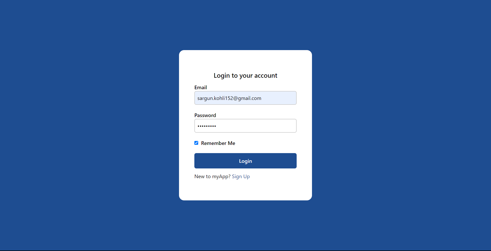
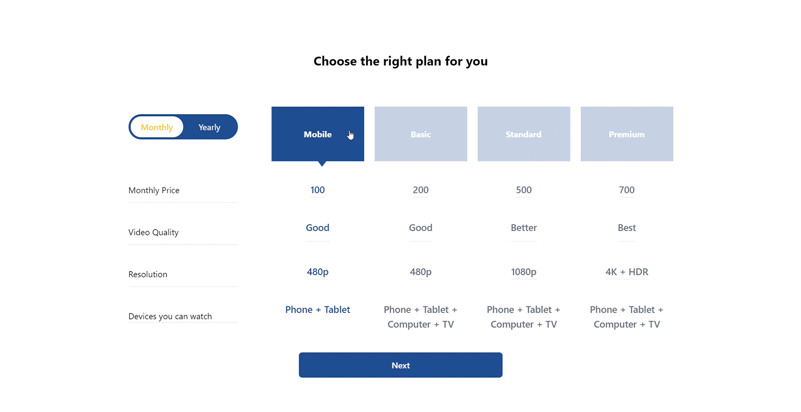

# Stripe Payment Gateway

Welcome to Stripe payment gateway project! This application allows users to subscribe to different plans on any particular platform, make payments using Stripe in test mode, and manage their account details. Below, you'll find information on how to get started with this project.





## Table of Contents

- [Project Overview](#project-overview)
- [Tech Stack](#tech-stack)
- [Getting Started](#getting-started)
- [Usage](#usage)
- [Contributing](#contributing)
- [License](#license)

## Project Overview

The Stripe payment gateway is designed to offer a seamless subscription and payment experience for users. Users can log in to their existing accounts or create new ones. Once logged in, they can choose from various subscription plans and proceed with payments using Stripe's test mode (where the only valid CVV is `4242 4242 4242 4242` for testing purposes). After a successful payment, users can view their account details, including their subscribed plan, expiration date (either monthly or yearly), and the option to change their plan.

## Tech Stack

This project utilizes a diverse set of technologies to create a full-stack application:

- Frontend:
  - HTML
  - CSS
  - JavaScript
  - React.js
  - Tailwind CSS

- Backend:
  - Node.js
  - Express.js
  - MongoDB Compass
  - Postman API for testing

- Database:
  - MongoDB Atlas

- Deployment and Version Control:
  - Git and GitHub for version control
  - Vercel and Render for deployment

## Getting Started

To set up this project on your local machine, follow these steps:

1. Clone the repository to your local machine:
   ```bash
   git clone https://github.com/sargunkohli152/Stripe_Payment_Gateway.git

2. Install project dependencies for both the frontend and backend:
   ```bash
   # Install frontend dependencies
   cd frontend
   npm install

   # Install backend dependencies
   cd ..
   cd backend
   npm install

3. Configure your MongoDB Atlas credentials in the server's configuration file.

4. Start the backend server:
   ```bash
   cd ..
   cd backend
   npm dev

5. Start the frontend development server:
   ```bash
   cd ..
   cd frontend
   npm run start

6. Access the application in your web browser at http://localhost:3000.

## Usage
The web portal allows you to login into the platform or create an account if you're new to it. You then get too choose a subscription plan based on your requirements and then the site takes you to the payment gateway where you can pay for the subscription selected. Since Stripe is used for testing purposes in test mode, the only account number that wouldshow successful payment is 4242 4242 4242 4242. After successful payment, the user will be showed a screen with their account details and current subscription model.

## Contributing
If you'd like to contribute to this project, follow these guidelines:
 - Fork the repository.
 - Create a new branch for your feature or bug fix: git checkout -b feature-name
 - Make your changes and commit them: git commit -m "Description of your changes".
 - Push your branch to your forked repository: git push origin feature-name
 - Create a pull request to merge your changes.

## License
MIT License

Permission is hereby granted, free of charge, to any person obtaining a copy
of this software and associated documentation files (the "Software"), to deal
in the Software without restriction, including without limitation the rights
to use, copy, modify, merge, publish, distribute, sublicense, and/or sell
copies of the Software, and to permit persons to whom the Software is
furnished to do so, subject to the following conditions:

The above copyright notice and this permission notice shall be included in all
copies or substantial portions of the Software.

THE SOFTWARE IS PROVIDED "AS IS", WITHOUT WARRANTY OF ANY KIND, EXPRESS OR
IMPLIED, INCLUDING BUT NOT LIMITED TO THE WARRANTIES OF MERCHANTABILITY,
FITNESS FOR A PARTICULAR PURPOSE AND NONINFRINGEMENT. IN NO EVENT SHALL THE
AUTHORS OR COPYRIGHT HOLDERS BE LIABLE FOR ANY CLAIM, DAMAGES OR OTHER
LIABILITY, WHETHER IN AN ACTION OF CONTRACT, TORT OR OTHERWISE, ARISING FROM,
OUT OF OR IN CONNECTION WITH THE SOFTWARE OR THE USE OR OTHER DEALINGS IN THE
SOFTWARE.

